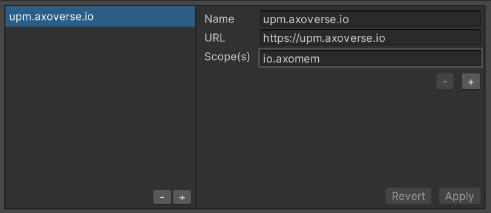

# Installation

## Install Unity
* Install Unity Hub from https://unity3d.com/get-unity/download
* In Unity Hub, Click on Installs > Install Editor > Archive Tab > Long Term Support
* Change the version to "2021.3"
* Expand `2021.3.9f1` and click "Unity Hub"
* In the installer, include Visual Studio Community and Click Install

Note - check with your administrator regarding which Unity license to use, otherwise
use a personal license for if you are doing this personal education.

## Git Fork
* Create an account at github.com and sign in (if you don't already have an account)
* Go to https://github.com/axoverse/xworld_amb.git 
* Click on "Fork" to create a copy in your personal github account

## Creating a Unity project
* Create your desired Unity projects directory (eg c:\users\<username>\Unity)
* In Unity Hub, go to Open > New project
* Select 3D Core as the template
* Set the location to your directory above
* Enter a project name (eg username_amb)

## Adding Axoverse dependencies
Go to Edit > Project Settings > Package Manager and add the following scoped registry: 

* Name: upm.axoverse.io
* URL: https://upm.axoverse.io
* Scope(s): io.axomem

* Click on Apply and wait for updates
* Go to Window>Package Manager and add the following packages via "Add Package by Name" (top right corner)
  * `io.axomem.xworld.assets`
  * `io.axomem.xworld.core`
* Wait for updates

## Git Clone
* Ensure you have git installed and added to path (https://git-scm.com/downloads)
* Open a cmd/terminal window and go to your project\Assets directory 
* Use `git clone https://github.com/<githubusername>/xworld_amb.git` to clone a copy of the repository to your local machine

## Running the demo content
Open these from the `Assets\xworld_amb\Scenes`
* Full hospital model - "AMB_Hospital"
* Hospital Simulation / routing test - "Routing"
* Demo Hotel model - "AMB_Hotel"
* Demo Office model - "AMB_Office" 
* Click "Play"

## Issue tracking
